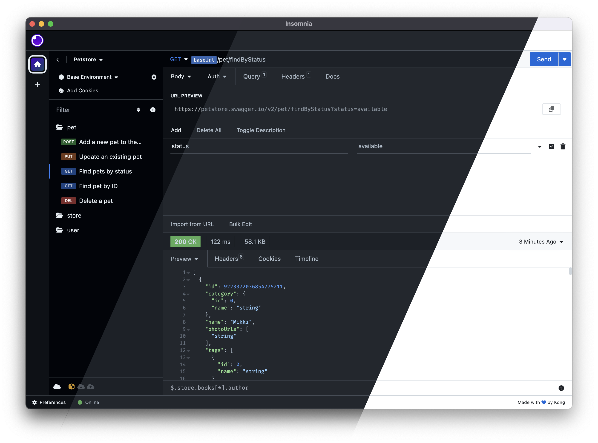

# GitHub Themes for Insomnia

This is a port of [GitHub's VS Code themes](https://github.com/primer/github-vscode-theme) for [Insomnia](https://insomnia.rest).

## Installation

1. Open Preferences in Insomnia
2. Open the Plugins tab
3. Paste `insomnia-plugin-github-themes` into the `npm-package-name` field
4. Click on Install Plugin
5. Open the Themes tab
6. Select your favorite GitHub theme

## Themes

All modern GitHub themes are available:

- GitHub Light Default
- GitHub Light High Contrast
- GitHub Light Colorblind
- GitHub Dark Default
- GitHub Dark High Contrast
- GitHub Dark Colorblind
- GitHub Dark Dimmed
